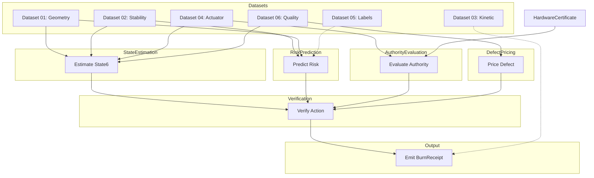

# Master Joined Schema — Tokamak Fusion Data to Coh-Fusion Objects

## Overview

This document defines the canonical mapping from the 6 tokamak fusion datasets to the Coh-Fusion project's governed objects: `State6`, `HardwareCertificate`, and `BurnReceipt`.

The joined schema provides the **single source of truth** for how raw fusion data flows into the controller/verifier pipeline.

---

## Shared Keys

These keys appear across all 6 datasets and serve as the join anchors:

| Key | Type | Purpose |
|-----|------|---------|
| `shot_id` | string | Unique discharge identifier |
| `t_ms` | float | Common control clock (milliseconds) |
| `regime_id` | string | Operating regime identifier (maps to `operating_regime_hash`) |
| `controller_cycle_id` | uint | Sequential control cycle counter |
| `predictor_version` | string | Version of risk prediction model |
| `estimator_version` | string | Version of state estimation model |
| `certificate_id` | string | Reference to governing `HardwareCertificate` |

---

## Core Projections

### Dataset 01: Geometry, Position, and Shape

**Purpose**: Axisymmetric magnetic-control state for real-time tokamak control

**Primary Key**: `shot_id`, `t_ms`

**Fields that map to `State6`**:

| Dataset Field | State6 Field | Mapping Rationale |
|--------------|--------------|-------------------|
| `z_axis_m` | `Z` | Direct vertical position observable |
| (derived from `z_axis_m` change) | `vZ` | Vertical velocity (dt of Z) |
| `r_axis_m` | — | Stored for boundary checks, not in State6 |
| `kappa` (elongation) | — | Stored for shape validation |
| `beta_n` | — | Stored for stability assessment |
| `q95` | — | Edge safety factor (risk predictor input) |

**Fields that map to `HardwareCertificate`**:

| Dataset Field | Certificate Field | Mapping Rationale |
|--------------|-------------------|-------------------|
| `wall_clearance_min_m` | — | Not in cert, used for margin calculation |
| `vertical_margin` | — | Used to compute admissible control envelope |

**Fields that flow to `BurnReceipt`**:

| Dataset Field | Receipt Field | Mapping Rationale |
|--------------|----------------|-------------------|
| `shot_id` | `control_ref` | Shot reference |
| `volume_m3` | — | Used in fuel/power calculation, not direct receipt field |

**Quality constraints**: Do not trust high-authority control if `equilibrium_status != good`

---

### Dataset 02: Stability and MHD Risk

**Purpose**: Instability-risk state for supervisory control and verifier

**Primary Key**: `shot_id`, `t_ms`

**Fields that map to `State6`**:

| Dataset Field | State6 Field | Mapping Rationale |
|--------------|--------------|-------------------|
| (derived from `tearing_risk_score`) | `W` | Tearing width proxy (normalized 0–1) |
| (derived from `dwdt_proxy`) | `vW` | Tearing growth-rate proxy |

**Fields that map to risk prediction** (used in verifier decision):

| Dataset Field | Usage |
|--------------|-------|
| `disruption_risk_score` | Disruption avoidance trigger |
| `tearing_risk_score` | Tearing suppression trigger |
| `vertical_event_risk_score` | VDE trigger |
| `locked_mode_amp` | Locked-mode detection |
| `radiated_power_frac` | Radiation fraction for H-mode transition detection |

**Quality constraints**: All risk scores must carry model version metadata (`predictor_version`)

---

### Dataset 03: Kinetic and Profile Summary

**Purpose**: Compact plasma-state summaries for supervisory control

**Primary Key**: `shot_id`, `t_ms`

**Fields used in verifier decision**:

| Dataset Field | Usage |
|--------------|-------|
| `stored_energy_mj` | Burn receipt fuel calculation |
| `pressure_norm` | Beta limit checking |
| `confinement_quality_score` | H-mode transition detection |
| `pedestal_height_kev` | Pedestal pressure for ELM stability |
| `bootstrap_fraction` | Current profile shape factor |

**Note**: This dataset is primarily for supervisory planning, not real-time State6. It informs:
- Trajectory planning
- Rampdown timing
- Performance optimization

---

### Dataset 04: Actuator Commands, Availability, and Health

**Purpose**: Authority accounting and actuation health

**Primary Key**: `shot_id`, `t_ms`

**Fields that map to `State6`**:

| Dataset Field | State6 Field | Mapping Rationale |
|--------------|--------------|-------------------|
| (from `pf_req_vector` + certificate) | `I_act` | Active vertical-control actuator state |
| (from `current_drive_req_mw`) | `I_cd` | Current-drive actuator state |

**Fields that map to `HardwareCertificate`**:

| Dataset Field | Certificate Field | Mapping Rationale |
|--------------|-------------------|-------------------|
| `pf_slew_margin` | `slew_limit` | Compare margin to certified limit |
| `pf_saturation_flag` | `saturation_limit` | Compare to certified saturation |
| — | `latency` | `actuator_delay_ms` compared to certified latency |
| — | `observation_error` | Compare achieved vs requested |
| `actuator_health_status` | — | Degraded/unavailable triggers regime change |

**Authority budget computation**:

```
available_authority = min(cert.slew_limit - current_slew, cert.saturation_limit - current_position)
authority_margin = available_authority - requested_action
```

**Quality constraints**: Never assume request equals achieved — must track request vs measured

---

### Dataset 05: Event Labels and Prediction Horizons

**Purpose**: Supervised labels for training/validation of risk predictors

**Primary Key**: `shot_id`, `t_ms`

**Fields used in verifier decision**:

| Dataset Field | Usage |
|--------------|-------|
| `safe_state_label` | Ground truth for safe/unsafe classification |
| `disruption_in_10ms` | 10ms horizon label for emergency response |
| `disruption_in_50ms` | 50ms horizon label for controlled response |
| `disruption_in_100ms` | 100ms horizon label for rampdown trigger |
| `time_to_disruption_ms` | Remaining time to disruption |
| `rampdown_start_in_50ms` | Rampdown onset label |
| `locked_mode_onset_in_20ms` | Locked-mode onset label |
| `tearing_onset_in_20ms` | Tearing onset label |
| `vde_onset_in_10ms` | VDE onset label |

**Note**: This dataset is for **training and evaluation only**, not real-time control. It provides:
- Labeled examples for ML risk predictors
- Threshold tuning for alarm systems
- False-alarm vs missed-alarm trade-off analysis

---

### Dataset 06: Data Quality, Uncertainty, and Defect Channels

**Purpose**: Convert weak observation into declared defect for verifier

**Primary Key**: `shot_id`, `t_ms`

**Fields that map to defect pricing in verifier**:

| Dataset Field | Usage |
|--------------|-------|
| `model_defect_est` | Model-side defect (prediction uncertainty) |
| `actuation_defect_est` | Actuation-side defect (actuator drift/gap) |
| `sensing_defect_est` | Sensor/observation defect (measurement noise/bias) |
| `total_defect_est` | Aggregate defect (sum or max policy) |
| `data_quality_status` | Quality flag: `good`/`warning`/`bad` |
| `sensor_confidence_score` | 0–1 confidence for observation |
| `estimator_confidence_score` | 0–1 confidence for state estimate |
| `equilibrium_residual_norm` | Reconstruction residual (model fit quality) |

**Defect dominance check in verifier**:

```
if total_defect_est > defectLimit then
  Decision.reject DefectExceeded
else if model_defect_est > gamma then
  Decision.reject ModelDefectDominance
else if actuation_defect_est > gamma then
  Decision.reject ActuationDefectDominance
else if sensing_defect_est > gamma then
  Decision.reject SensingDefectDominance
```

**Quality constraints**: `total_defect_est` must equal declared aggregation policy; version all model-derived fields

---

## Binding to Project Types

### State6 = Minimal Real-Time Verifier State

```
State6 α where
  Z     : α   -- vertical displacement (from Dataset 01: z_axis_m)
  vZ    : α   -- vertical velocity (derived from Dataset 01 time-series)
  I_act : α   -- actuator state (from Dataset 04: pf_meas_vector)
  W     : α   -- tearing width proxy (from Dataset 02: tearing_risk_score normalized)
  vW    : α   -- tearing growth-rate (from Dataset 02: dwdt_proxy)
  I_cd  : α   -- current-drive state (from Dataset 04: current_drive_meas_mw)
```

### HardwareCertificate = Calibrated Authority / Regime Envelope

```
HardwareCertificate where
  latency            : QFixed  -- tau_sensor (Dataset 04: actuator_delay_ms)
  observation_error  : QFixed  -- observation uncertainty
  slew_limit         : QFixed  -- I_dot_max (Dataset 04: pf_slew_margin capacity)
  saturation_limit   : QFixed  -- I_max (Dataset 04: pf_saturation_limit)
  operating_regime_hash : String -- regime_id mapping
  calibration_epoch     : String -- timestamp
  expiry                : String -- validity period
  root_of_trust      : String
  signature          : String
```

### BurnReceipt = Verified Decision Output

```
BurnReceipt where
  receipt_id         : String
  certificate_ref    : String  -- certificate_id
  fuel_consumed_mj   : Float  -- Dataset 03: stored_energy_mj
  power_peak_mw      : Float  -- computed from Dataset 01/04
  duration_ms        : Uint   -- control cycle duration
  control_ref        : String  -- shot_id
  integrity_hash     : String  -- SHA-256 of receipt
  burn_mode          : Enum    -- from operating_phase
  resource_limits    : Object  -- from certificate regime
```

---

## Join Semantics

### Time-Alignment

All 6 datasets must be aligned to the same `t_ms` grid (typical: 1ms cadence). The controller cycle consumes one aligned row per dataset per control frame.

### Join Keys

```
Primary Join: shot_id + t_ms
Secondary Join: certificate_id → HardwareCertificate.certificate_id
Tertiary Join: regime_id → HardwareCertificate.operating_regime_hash
```

### Missing Data Handling

| Dataset | Missing Critical Field | Action |
|---------|----------------------|--------|
| 01 | `z_axis_m` or `ip_ma` | Reject frame, mark defect |
| 02 | risk scores | Use last-known values with staleness flag |
| 04 | `pf_meas_vector` | Use request as proxy, flag actuation_defect |
| 06 | `total_defect_est` | Compute from components, flag quality=bad |

---

## Data Flow Diagram



---

## Appendix A: Missing Data Handling

### Strategies by Criticality

| Critical Field Missing | Dataset | Strategy | Defect Impact |
|------------------------|---------|----------|---------------|
| `z_axis_m` | 01 | **REJECT frame** — cannot compute State6 | Sensing defect = 1.0 |
| `ip_ma` | 01 | **REJECT frame** — plasma current required | Sensing defect = 1.0 |
| `r_axis_m` | 01 | Compute from boundary fit, flag if >10% error | Sensing defect = 0.3 |
| `equilibrium_status` | 01 | Assume `warning`, use last-known equilibrium | Model defect = 0.2 |
| `tearing_risk_score` | 02 | Use `mhd_activity_rms` as fallback proxy | Model defect = 0.3 |
| `disruption_risk_score` | 02 | Use baseline threshold (0.1), flag as uncertain | Model defect = 0.5 |
| `pf_meas_vector` | 04 | Use `pf_req_vector` as proxy, flag actuation defect | Actuation defect = 0.3 |
| `actuator_delay_ms` | 04 | Use certificate latency as proxy | Actuation defect = 0.2 |
| `total_defect_est` | 06 | Compute from components, flag quality=bad | — |
| `sensor_confidence_score` | 06 | Use 0.5 (midpoint), apply quality multiplier | — |

### Staleness Handling

| Field Type | Max Staleness (ms) | Action if Stale |
|------------|-------------------|----------------|
| Magnetic (D01) | 10 | Reject frame |
| Stability (D02) | 50 | Flag as uncertain, apply defect multiplier |
| Actuator (D04) | 20 | Flag as degraded |
| Quality (D06) | 10 | Reject frame |

### Interpolation Rules

| Scenario | Interpolation Allowed? | Max Extrapolation |
|----------|---------------------|------------------|
| `z_axis_m` missing for 1 frame | Yes (linear) | 2 frames |
| `z_axis_m` missing for >2 frames | **No** | — |
| `tearing_risk_score` missing | Yes (forward-fill) | 5 frames |
| `pf_meas_vector` missing | Use request as proxy | 0 frames |

---

## Appendix B: Edge Cases

### 1. Regime Transition Edge Cases

| Edge Case | Detection | Handling |
|----------|----------|----------|
| `regime_id` changes mid-shot | Compare `regime_id` at `t_ms` vs `t_ms-1` | Trigger certificate re-validation |
| `regime_id` mismatch with certificate | Compare to cert operating_regime_hash | Reject frame, log regime mismatch |
| Unknown `regime_id` | Look up in regime registry | Use default regime (conservative margins) |

### 2. Actuator Saturation Edge Cases

| Edge Case | Detection | Handling |
|-----------|-----------|----------|
| PF saturation in request | `pf_saturation_flag == true` | Reduce authority by 50%, warn |
| PF saturation in achieved | `pf_meas` significantly < `pf_req` | Flag actuation defect |
| Both request and achieved saturated | Compare to certificate limits | Trigger fallback mode |

### 3. Quality Degradation Edge Cases

| Edge Case | Detection | Handling |
|-----------|-----------|----------|
| `data_quality_status` = warning | Direct from D06 | Apply 1.5x defect multiplier |
| `data_quality_status` = bad | Direct from D06 | Apply 2.0x defect multiplier, reject if defect exceeds |
| Multiple stale signals | Count in D06 | Proportional defect increase |

### 4. Prediction Confidence Edge Cases

| Edge Case | Detection | Handling |
|-----------|-----------|----------|
| Unknown `predictor_version` | Not in registry | Warn, use baseline model |
| Risk score near threshold | Within 10% of limit | Flag as marginal |
| Conflicting risk indicators | Multiple high risk scores | Take maximum, trigger review |

---

## Appendix C: Completeness Validation Rules

### Required Fields by Dataset

**Dataset 01 (Geometry)** — All required for State6 estimation:
- [ ] `shot_id`
- [ ] `t_ms`
- [ ] `ip_ma`
- [ ] `r_axis_m`
- [ ] `z_axis_m`
- [ ] `equilibrium_status`

**Dataset 02 (Stability)** — Required for risk prediction:
- [ ] `shot_id`
- [ ] `t_ms`
- [ ] At least one risk score field (`tearing_risk_score`, `disruption_risk_score`, `vertical_event_risk_score`)

**Dataset 03 (Kinetic)** — Required for supervisory:
- [ ] `shot_id`
- [ ] `t_ms`
- [ ] At least one profile field (`stored_energy_mj`, `pressure_norm`)

**Dataset 04 (Actuator)** — Required for authority evaluation:
- [ ] `shot_id`
- [ ] `t_ms`
- [ ] Either `pf_req_vector` or `pf_meas_vector`

**Dataset 05 (Labels)** — Training/evaluation only:
- [ ] `shot_id`
- [ ] `t_ms`
- Optional: Label fields

**Dataset 06 (Quality)** — Required for defect pricing:
- [ ] `shot_id`
- [ ] `t_ms`
- [ ] `total_defect_est` (or all three components)

### Cross-Dataset Consistency Checks

| Check | Validation |
|-------|------------|
| `shot_id` matches across all datasets | All 6 datasets must have identical `shot_id` |
| `t_ms` matches within 1ms tolerance | D01, D02, D04, D06 must align to same grid |
| `regime_id` consistent | Must match certificate's `operating_regime_hash` |
| Version fields present | `predictor_version`, `estimator_version` must not be empty |

---

## Version History

| Version | Date | Changes |
|---------|------|---------|
| 1.0.0 | 2026-03-29 | Initial master joined schema |
| 1.0.1 | 2026-03-29 | Added appendices A-C: missing data handling, edge cases, completeness validation |

---

## Next Steps

1. **Document controller consumption workflow** — detailed pipeline from ingest to receipt (completed)
2. **Define JSON schemas** for each dataset frame
3. **Define Lean structures** for each dataset frame + FusionJoinedFrame
4. **Implement adapters** from FusionJoinedFrame → State6, AuthorityBudget, DefectBundle