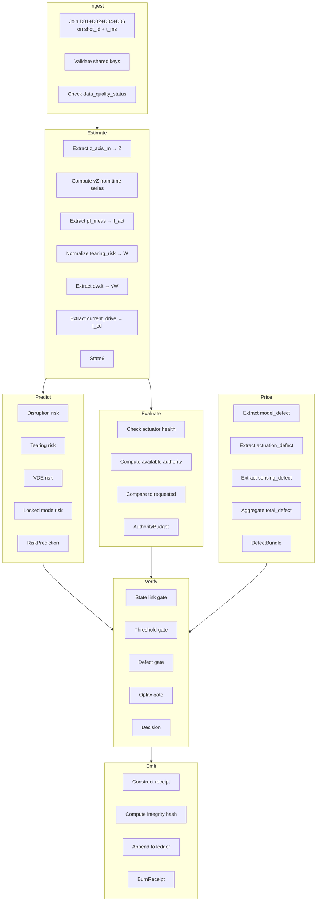

# Controller Consumption Workflow — Fusion Data to Verifier Pipeline

## Overview

This document details how the Coh-Fusion controller/verifier consumes the 6 tokamak fusion datasets through a staged pipeline:

**ingest → estimate state → predict risk → evaluate authority → price defect → verify action → emit receipt**

The workflow transforms raw plasma data into bounded `State6` observables, signed decisions, and auditable receipts.

---

## Pipeline Stages

### Stage 1: Ingest

**Input**: Aligned rows from datasets 01, 02, 04, 06 (at `t_ms` cadence)

**Process**:
1. Load one frame from each dataset, joined on `shot_id` + `t_ms`
2. Validate shared keys are present and consistent:
   - `shot_id` matches
   - `regime_id` matches certificate regime
   - `predictor_version` and `estimator_version` are known
3. Check dataset 06 `data_quality_status`:
   - `good` → proceed with full confidence
   - `warning` → flag for degraded processing
   - `bad` → reject frame, trigger fallback

**Output**: Raw unvalidated frame bundle

---

### Stage 2: Estimate State

**Input**: Datasets 01 (Geometry), 02 (Stability), 04 (Actuator), 06 (Quality)

**Process**:

```
FusionJoinedFrame → State6 α
```

| Dataset Field | State6 Field | Transformation |
|--------------|--------------|---------------|
| `z_axis_m` | `Z` | Direct mapping (in meters, converted to QFixed) |
| `vZ` (computed) | `vZ` | (z_axis_m[t] - z_axis_m[t-1]) / dt |
| `pf_meas_vector` | `I_act` | Extract vertical control component |
| `tearing_risk_score` | `W` | Normalize to 0–1 range |
| `dwdt_proxy` | `vW` | Normalized growth rate |
| `current_drive_meas_mw` | `I_cd` | Normalize to actuator range |

**State estimation constraints** (from Dataset 06):
- If `estimator_confidence_score < 0.5` → flag state as uncertain
- If `magnetic_data_freshness_ms > 10` → mark state as stale
- If `missing_core_signal_count > 0` → reject state estimation

**State bound computation**:
- Compute upper/lower bounds from `observation_error` in certificate
- Propagate through state transformation

**Output**: `State6 α` with confidence bounds

---

### Stage 3: Predict Risk

**Input**: State estimate + Dataset 02 (Stability) risk features + Dataset 05 (Labels for training)

**Process**:

```
State6 α × RiskFeatures → RiskPrediction
```

**Risk prediction components**:

| Risk Type | Input Features | Output |
|-----------|----------------|--------|
| Disruption | `disruption_risk_score`, `beta_n`, `q95`, `density_frac_greenwald` | probability 0–1 |
| Tearing | `tearing_risk_score`, `W`, `vW`, `li_3` | probability 0–1 |
| VDE | `vertical_event_risk_score`, `z_axis_m`, `vZ`, `vertical_margin` | probability 0–1 |
| Locked Mode | `locked_mode_amp`, `mirnov_bandpower_low` | probability 0–1 |

**Predictor versioning**:
- Compare `predictor_version` to expected version in certificate
- Log version mismatch as advisory

**Horizon computation** (from Dataset 05 labels during training):
- Train models to predict:
  - `disruption_in_10ms`, `disruption_in_50ms`, `disruption_in_100ms`
  - `tearing_onset_in_20ms`
  - `vde_onset_in_10ms`
  - `rampdown_start_in_50ms`

**Output**: RiskPrediction with probabilities and confidence intervals

---

### Stage 4: Evaluate Authority

**Input**: Dataset 04 (Actuator Commands) + HardwareCertificate

**Process**:

```
FusionJoinedFrame × HardwareCertificate → AuthorityBudget
```

**Authority budget computation**:

```
available_slew = cert.slew_limit - current_slew_rate
available_position = cert.saturation_limit - current_position
available_authority = min(available_slew, available_position)
authority_margin = available_authority - requested_action
```

**Actuator health checking**:
| Status | Action |
|--------|--------|
| `good` | Full authority available |
| `degraded` | Reduce authority by 50%, log warning |
| `unavailable` | Zero authority, trigger fallback |

**Latency verification**:
```
if actuator_delay_ms > cert.latency * 1.5 then
  flag as degraded latency
```

**Slew margin check**:
```
if pf_slew_margin < 0.2 then
  flag as low authority reserve
```

**Output**: `AuthorityBudget` with available authority and margin

---

### Stage 5: Price Defect

**Input**: Dataset 06 (Data Quality/Defect Channels)

**Process**:

```
FusionJoinedFrame × DefectPolicy → DefectBundle
```

**Defect component extraction**:

| Component | Source Field | Computation |
|-----------|--------------|-------------|
| Model defect | `model_defect_est` | Direct from Dataset 06 |
| Actuation defect | `actuation_defect_est` | Direct from Dataset 06 |
| Sensing defect | `sensing_defect_est` | Direct from Dataset 06 |
| Total defect | `total_defect_est` | Aggregation policy (sum or max) |

**Defect dominance analysis**:
```
dominant_component = max(model_defect, actuation_defect, sensing_defect)
dominant_ratio = dominant_component / total_defect
```

**Confidence-based defect adjustment**:
```
if sensor_confidence_score < 0.5 then
  sensing_defect = sensing_defect * 1.5
if estimator_confidence_score < 0.5 then
  model_defect = model_defect * 1.5
```

**Quality flag inheritance**:
| data_quality_status | Defect Multiplier |
|---------------------|-------------------|
| `good` | 1.0x |
| `warning` | 1.5x |
| `bad` | 2.0x |

**Output**: `DefectBundle` with component and total defect values

---

### Stage 6: Verify Action

**Input**: State6 + RiskPrediction + AuthorityBudget + DefectBundle + HardwareCertificate

**Process** (implemented in `verifyRV`):

```
ParamsFus α × MicroReceipt α × State6 α × threshold × defectLimit × gamma → Decision
```

**Verification gates**:

1. **State Link Gate**:
   ```
   if receipt.statePrev ≠ expectedState then
     reject unauthorizedTransition
   ```

2. **Threshold Gate**:
   ```
   if VgeomFus(receipt.stateNext) ≥ threshold then
     reject thresholdExceeded
   ```

3. **Defect Gate**:
   ```
   if receipt.defectDeclared ≥ defectLimit then
     reject defectOutOfBounds
   ```

4. **Oplax Gate** (dissipation inequality):
   ```
   V(s') ≤ V(s) - (1-γ) * spend + defect
   ```

   If violated:
   ```
   reject oplaxViolation
   ```

**Threshold computation**:
- `threshold` = public safety envelope boundary (from certificate regime)
- `defectLimit` = maximum tolerated defect (from certificate)
- `gamma` = dissipation factor (from certificate)

**Authority affordability check**:
```
if requested_spend > authority_margin then
  reject insufficientAuthority
```

**Output**: `Decision.accept` or `Decision.reject` with reject code

---

### Stage 7: Emit Receipt

**Input**: Verified decision + all pipeline state

**Process**:

```
Decision × State6 × spendAuth × DefectBundle × Metadata → BurnReceipt
```

**Receipt construction**:

```
receipt_id = "burn_" + hash(shot_id, t_ms, controller_cycle_id)
certificate_ref = certificate_id
control_ref = shot_id
integrity_hash = SHA-256(receipt fields)
burn_mode = operating_phase (from Dataset 05)
```

**Spend decomposition** (from AuthorityBudget):
- `spendAuth` = actual authority consumed
- `spendMargin` = authority margin remaining

**Defect decomposition** (from DefectBundle):
- `model_defect` component
- `actuation_defect` component
- `sensing_defect` component
- `total_defect` declared

**Provenance metadata**:
- `predictor_version`
- `estimator_version`
- `certificate_id`
- `regime_id`
- `controller_cycle_id`

**Output**: `BurnReceipt` ready for ledger append

---

## Data Flow Diagram



---

## Error Handling

| Stage | Failure Mode | Recovery |
|-------|--------------|----------|
| Ingest | Missing shot_id | Reject frame, log error |
| Estimate | Missing z_axis_m | Reject frame, flag defect |
| Predict | Unknown predictor_version | Use last-known model, warn |
| Evaluate | Actuator unavailable | Trigger fallback mode |
| Price | Missing total_defect_est | Compute from components |
| Verify | Oplax violation | Reject, rollback state |
| Emit | Ledger write fail | Retry with exponential backoff |

---

## Version History

| Version | Date | Changes |
|---------|------|---------|
| 1.0.0 | 2026-03-29 | Initial controller consumption workflow |

---

## Cross-References

- [Master Joined Schema](./08_master_joined_schema.md) — Data schema definitions
- [VerifierSemantics.lean](../src/CohFusion/Runtime/VerifierSemantics.lean) — Core verification logic
- [Bridge.lean](../src/CohFusion/Runtime/Bridge.lean) — Trace verification
- [State.lean](../src/CohFusion/Core/State.lean) — State6 definition
- [Receipt.lean](../src/CohFusion/Core/Receipt.lean) — MicroReceipt definition
- [HardwareCertificate.lean](../src/CohFusion/Product/HardwareCertificate.lean) — Certificate structure